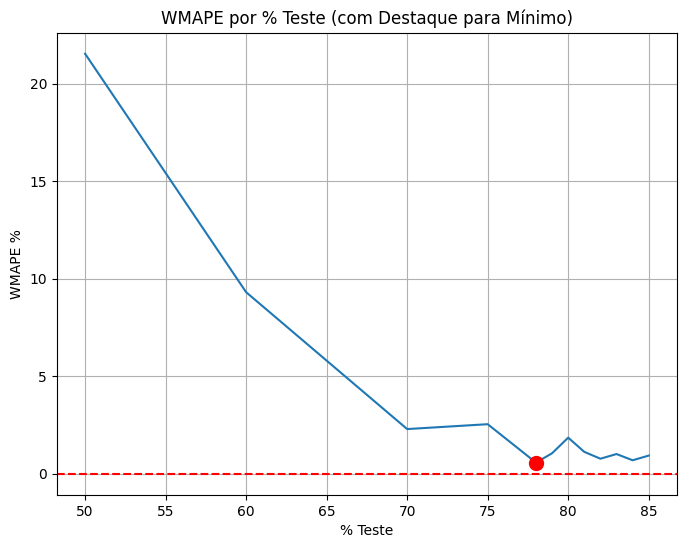
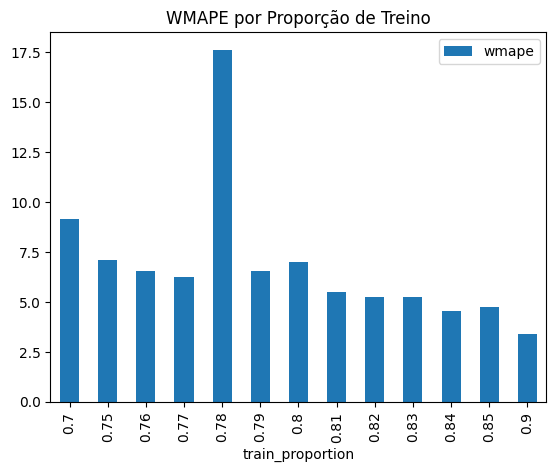
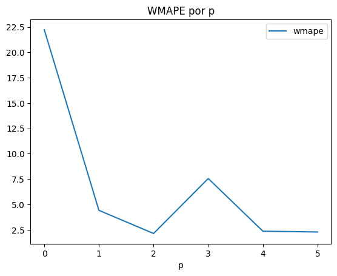
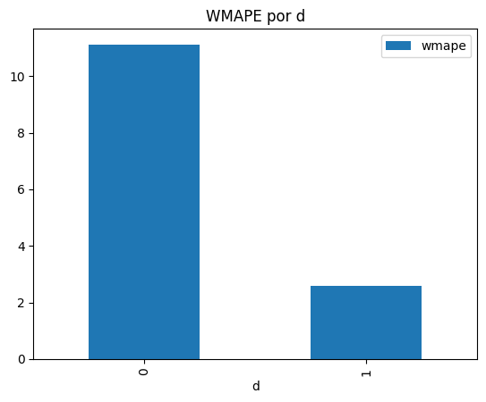
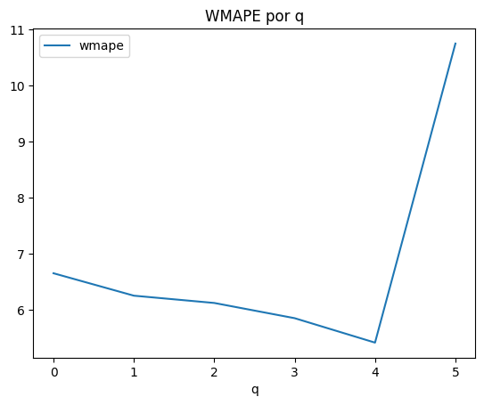
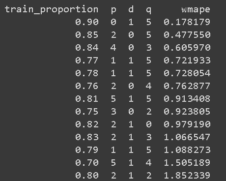
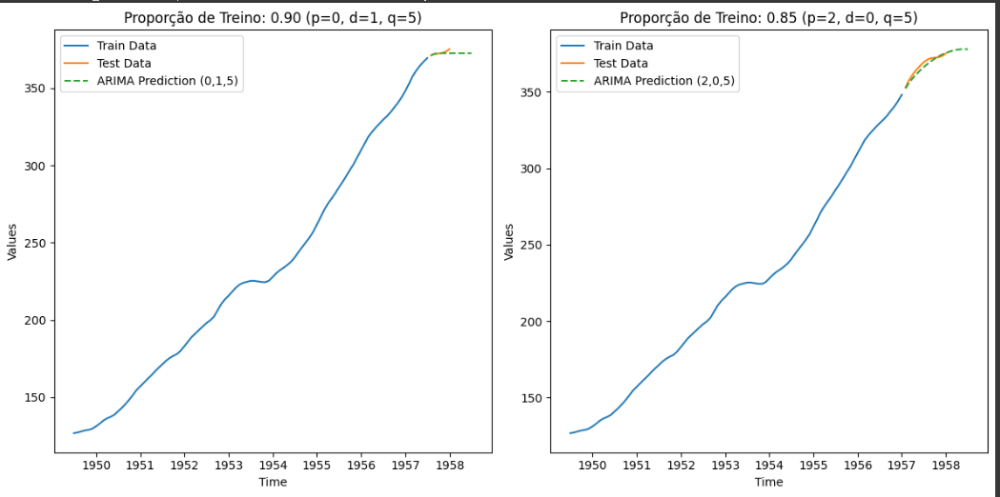
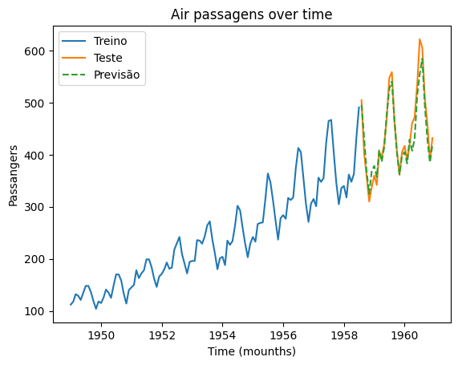
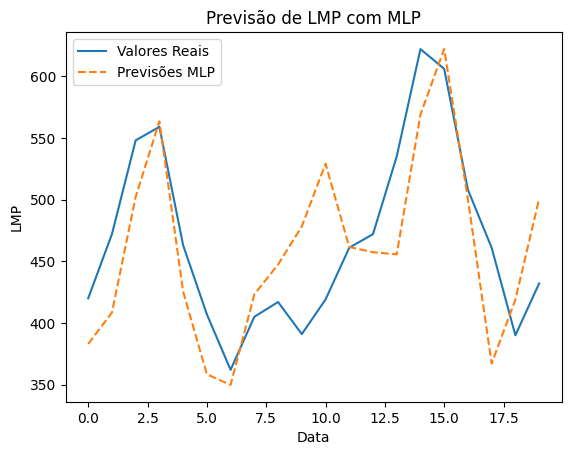

# Problem Context

I am currently taking a class on Time Series, which is an introductory course covering the basic concepts of machine learning. It's an elective course, so it's not part of the core curriculum. There are no exams, only assignments where we are tasked with researching, implementing, and presenting solutions.

For one of our assignments, the professor has asked us to select a dataset from Kaggle and implement prediction models using both ARIMA and MLP. Afterward, we are required to calculate the WMAPE (Weighted Mean Absolute Percentage Error) to evaluate which model performs better.

# Dataset Description

I chose this dataset, which contains monthly totals of international airline passengers from 1949 to 1960. The dataset includes two columns: the first represents the date, and the second represents the number of passengers. This dataset is often used for time series analysis and forecasting, making it an ideal choice for implementing models like ARIMA and MLP. The clear trend and seasonality patterns present in the data provide a great opportunity to evaluate the performance of these prediction models.

# 1. Implementing ARIMA

Iniciei com a parte fundamental: importei o dataset e o carreguei com o pandas. Em seguida, plotei o gráfico da série temporal para entender o comportamento dos dados.

```python
url = 'https://raw.githubusercontent.com/jbrownlee/Datasets/master/airline-passengers.csv'
data = pd.read_csv(url, index_col='Month', parse_dates=True)
plt.plot(data)
plt.title('Air passagens over time')
plt.xlabel('Time (mounths)')
plt.ylabel('Passangers')
plt.show()
```


Ao observar o gráfico, realizei algumas análises preliminares que revelaram:

- Tendência: Existe um claro crescimento ao longo dos anos.
- Sazonalidade: Aparentemente, ocorrem picos em períodos regulares, indicando aumentos em épocas específicas, possivelmente feriados ou temporadas de férias.
- Volatilidade crescente: A amplitude das variações entre os meses está aumentando ao longo do tempo.

Com essas observações, segui para a separação dos dados, utilizando 80% para treino e 20% para teste.

```python
train_size_sazionalido = int(len(data) * 0.8)
train_data_sazionalizado = data[:train_size_sazionalido]
test_data_sazionalizado = data[train_size_sazionalido:]

#Plotando codigo
plt.plot(train_data_sazionalizado, label='Treino')
plt.plot(test_data_sazionalizado, label='Teste')
plt.title('Air passagens over time')
plt.xlabel('Time (mounths)')
plt.ylabel('Passangers')
plt.legend()
```


O próximo passo foi ajustar o modelo ARIMA. Com base nas pesquisas realizadas, as configurações que pareciam adequadas foram order=(5,1,0).

```python
model = ARIMA(train_data_sazionalizado, order=(5,1,0))
model_fit = model.fit()
```

Após o ajuste, fiz a previsão e plotei o gráfico comparando os dados reais com a previsão do modelo.

```python
arima_pred = model_fit.forecast(steps=len(test_data_sazionalizado))

plt.plot(train_data_sazionalizado, label='Treino')
plt.plot(test_data_sazionalizado, label='Teste')
plt.plot(arima_pred, label='Previsão', linestyle='--')
plt.title('Air passagens over time')
plt.xlabel('Time (mounths)')
plt.ylabel('Passangers')
plt.legend()
```


Percebi que o modelo não estava prevendo corretamente. Lembrei-me da importância de remover a sazonalidade, como a professora havia mencionado. Assim, apliquei a decomposição sazonal para remover esse componente.

```python
result_sazional = seasonal_decompose(train_data_sazionalizado, model='additive', period=12)

plt.plot(result_sazional.trend, label='Deseasonalized Trend')
plt.title('Air Passengers Deseasonalized Trend')
plt.xlabel('Time (months)')
plt.ylabel('Passengers')
plt.legend()
plt.show()
```


Refiz todo o processo com os dados deseasonalizados e obtive o seguinte gráfico:

```python
train_size = int(len(result_sazional.trend) * 0.8)
train_deseasonalized = result_sazional.trend[:train_size]
test_deseasonalized = result_sazional.trend[train_size:]
model_deseasonalized = ARIMA(train_deseasonalized, order=(5,1,0))
model_deseasonalized_fit = model_deseasonalized.fit()
arima_pred_deseasonalized = model_deseasonalized_fit.forecast(steps=len(test_deseasonalized))
plt.plot(train_deseasonalized, label='Deseasonalized Train')
plt.plot(test_deseasonalized, label='Deseasonalized Test')
plt.plot(arima_pred_deseasonalized, label='Deseasonalized ARIMA Prediction', linestyle='--')
plt.title('Air Passengers Deseasonalized Trend and ARIMA Prediction')
plt.xlabel('Time (months)')
plt.ylabel('Passengers')
plt.legend()
plt.show()
```


Para avaliar a precisão do modelo, utilizei a métrica WMAPE (Weighted Mean Absolute Percentage Error) tanto nos dados sazonais quanto nos deseasonalizados:

```python
def wmape(y_true, y_pred):
    return np.sum(np.abs(y_true - y_pred) / y_true) / len(y_true)

wape_arima = wmape(test_data_sazionalizado['Passengers'].values, arima_pred)
print(f'WMAPE do modelo ARIMA Sazionalizado: {wape_arima * 100:.2f}%')

wape_arima_deseasonalized = wmape(test_deseasonalized.values, arima_pred_deseasonalized)
print(f'WMAPE do modelo ARIMA desazonalizado: {wape_arima_deseasonalized * 100:.2f}%')
```

Os resultados foram:

- WMAPE do modelo ARIMA Sazonalizado: 16.15%
- WMAPE do modelo ARIMA Deseasonalizado: 1.85%

Após os ajustes iniciais, decidi realizar testes com diferentes proporções de treino e cheguei aos seguintes resultados:
(Considere as porcentagens no eixo X como a quantidade de dados alocada para o modelo de treino)


## Melhorando o WMAPE

Meu objetivo era reduzir ainda mais o WMAPE. Para isso, decidi alterar os parâmetros do modelo. Com a ajuda de uma sugestão, utilizei os seguintes intervalos para p, d e q:

p: 0-6  
d: 0-2  
q: 0-6

Montei um loop para testar todas as combinações possíveis desses parâmetros, junto com várias proporções de treino (de 0.75 a 0.90). Os resultados foram salvos em um arquivo CSV para análise posterior.

```python
# Função WMAPE
def wmape(y_true, y_pred):
    return np.sum(np.abs(y_true - y_pred)) / np.sum(np.abs(y_true)) * 100

# Definir o range de valores para p, d, q e proporção de treino
p_values = range(0, 6)
d_values = range(0, 2)
q_values = range(0, 6)

# Testar diferentes proporções de treino: 50%, 60%, 70%, 80%, 85%
train_proportions = [0.7, 0.75, 0.76, 0.77, 0.78, 0.79, 0.8, 0.81, 0.82, 0.83, 0.84, 0.85, 0.9]

# Criar todas as combinações possíveis de p, d, q
pdq_combinations = list(itertools.product(p_values, d_values, q_values))

# Lista para armazenar os resultados
results = []

# Loop para testar cada proporção de treino e cada combinação de p, d, q
for train_prop in train_proportions:
    # Definir o tamanho do conjunto de treino com base na proporção atual
    train_size = int(len(result_sazional.trend) * train_prop)

    # Dividir os dados em treino e teste com base na proporção atual
    train_deseasonalized = result_sazional.trend[:train_size]
    test_deseasonalized = result_sazional.trend[train_size:]

    # Testar cada combinação de p, d, q
    for pdq in pdq_combinations:
        try:
            # Ajustar o modelo ARIMA para cada combinação de p, d, q
            model = ARIMA(train_deseasonalized, order=pdq)
            model_fit = model.fit()

            # Fazer previsões
            predictions = model_fit.forecast(steps=len(test_deseasonalized))

            # Calcular WMAPE
            wmape_value = wmape(test_deseasonalized, predictions)

            # Armazenar os resultados em um dicionário
            result = {
                'p': pdq[0],
                'd': pdq[1],
                'q': pdq[2],
                'train_proportion': train_prop,
                'wmape': wmape_value
            }
            results.append(result)
        except:
            continue

# Converter os resultados em um DataFrame
df_results = pd.DataFrame(results)

# Exibir o DataFrame com os resultados
display(df_results)
# Salvar os resultados em um arquivo CSV para análise posterior
df_results.to_csv('arima_wmape_results.csv', index=False)
```

Nota: Posteriormente, descobri que esse processo se chama GridSearch e já existem métodos prontos para realizá-lo.

## Melhor Combinação de Parâmetros

Após rodar os testes, a melhor combinação encontrada foi:

p: 0  
d: 1  
q: 5  
Proporção de treino: 90%  
WMAPE: 0.178179

Outro ponto interessante foi a relação entre a proporção de treino e o WMAPE:


Eu inicialmente pensava que a proporção de treino de 78% seria a melhor escolha, mas os testes mostraram que outras proporções, como 90%, geraram resultados melhores.  
Também fiz algumas análises sobre a relação de WMAPE com os parâmetros p, d e q, e apesar de ter plotado os gráficos, não consegui extrair conclusões muito relevantes além dos melhores resultados.




As melhores combinações de parâmetros encontradas foram as seguintes:


Por fim, plotei as duas melhores combinações:


## Adicionando Parâmetros Sazonais

Enfrentei alguns problemas com o código da minha abordagem inicial de MLP e pedi a ajuda de um colega, que sugeriu a inclusão de parâmetros sazonais no modelo ARIMA. Ao adicionar o parâmetro seasonal_order, o desempenho do modelo melhorou significativamente:

```python
model_so = ARIMA(train_data_sazionalizado, seasonal_order=(12,1,0,12))
model_so_fit = model_so.fit()

arima_pred_so = model_so_fit.forecast(steps=len(test_data_sazionalizado))
```



Com esse ajuste, a modelagem foi otimizada, resultando em previsões mais precisas e adequadas às características sazonais dos dados.

# Modelo MLP

Após a implementação do modelo ARIMA, segui para a criação e análise de um modelo de rede neural de Perceptron Multicamadas (MLP), adequado para séries temporais com múltiplas variáveis.

## Preparando os Dados

A primeira etapa foi separar os dados em conjuntos de treino e teste, similar ao que fiz com o modelo ARIMA, mas desta vez com 78% dos dados alocados para treino. Aqui está o código utilizado:

```python
train_size_lmp = int(len(data) * 0.78)
train_lmp = data[:train_size_lmp]
test_lmp = data[train_size_lmp:]

# Plotar dados de treino e teste
plt.plot(train_lmp, label='Treino')
plt.plot(test_lmp, label='Teste')
plt.legend(['Treino', 'Teste'])
plt.xlabel('Data')
plt.ylabel('LMP')
plt.show()
```

A divisão e a visualização dos dados permitiram observar que, assim como no ARIMA, havia um padrão claro de tendência e sazonalidade nos dados.

## Normalizando os Dados

Para melhorar a eficiência e estabilidade do modelo MLP, foi necessário normalizar os dados, já que redes neurais performam melhor quando os dados estão em uma escala semelhante. Usei o MinMaxScaler do sklearn para transformar os dados entre 0 e 1.

```python
scaler = MinMaxScaler()
train_lmp_scaled = scaler.fit_transform(train_lmp)
test_lmp_scaled = scaler.transform(test_lmp)
```

## Criando Dados Supervisionados

Como o MLP é um modelo supervisionado, precisei formatar os dados para que o modelo pudesse aprender a prever o próximo valor da série temporal com base em valores anteriores. O parâmetro look_back foi definido como 12, significando que o modelo usaria os últimos 12 meses para prever o próximo valor

```python
def create_supervised_data(data, look_back=1):
    X, y = [], []
    for i in range(len(data)-look_back):
        X.append(data[i:i+look_back, 0])
        y.append(data[i+look_back, 0])
    return np.array(X), np.array(y)

look_back = 12
X_train, y_train = create_supervised_data(train_lmp_scaled, look_back)
X_test, y_test = create_supervised_data(test_lmp_scaled, look_back)
```

## Criando e Treinando o Modelo MLP

Com os dados preparados, criei um modelo MLP simples, com uma única camada Dense e função de ativação linear. O modelo foi treinado por 10 épocas, utilizando o otimizador adam e a função de perda mean squared error (MSE).

```python
mlp_model = Sequential()
mlp_model.add(Dense(1, input_dim=look_back))
mlp_model.compile(loss='mse', optimizer='adam')

# Treinando o modelo com 100 épocas
mlp_model.fit(X_train, y_train, epochs=10, batch_size=16, verbose=1)
```

Após o treinamento, o modelo estava pronto para realizar previsões nos dados de teste.

## Fazendo Previsões e Revertendo a Normalização

Depois de prever os valores com o modelo treinado, foi necessário reverter a normalização para comparar as previsões diretamente com os valores reais:

```python
mlp_pred_scaled = mlp_model.predict(X_test)
mlp_pred = scaler.inverse_transform(mlp_pred_scaled)
```

## Visualizando os Resultados

A seguir, plotei os valores reais contra as previsões feitas pelo modelo MLP para avaliar a qualidade do ajuste:

```python
plt.plot(test_lmp[12:].values, label='Valores Reais')
plt.plot(mlp_pred, label='Previsões MLP', linestyle='--')
plt.title('Previsão de LMP com MLP')
plt.xlabel('Data')
plt.ylabel('LMP')
plt.legend()
plt.show()
```


A visualização mostrou que o modelo MLP conseguiu seguir razoavelmente bem a tendência dos dados, mas ainda apresentou algumas variações, especialmente em pontos onde a volatilidade era mais pronunciada.

## Calculando o WMAPE

Por fim, calculei o WMAPE para avaliar a precisão do modelo. Para isso, foi necessário reverter os valores de teste também para a escala original:

```python
y_test_rescaled = scaler.inverse_transform(y_test.reshape(-1, 1))
wmape = np.sum(np.abs(y_test_rescaled - mlp_pred)) / np.sum(np.abs(y_test_rescaled))

print(f"WMAPE: {wmape:.2f}")
```
