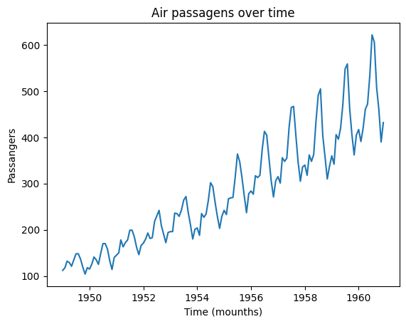
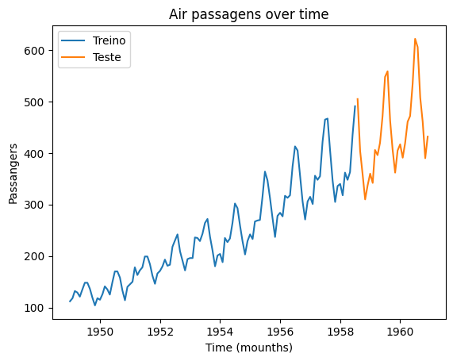
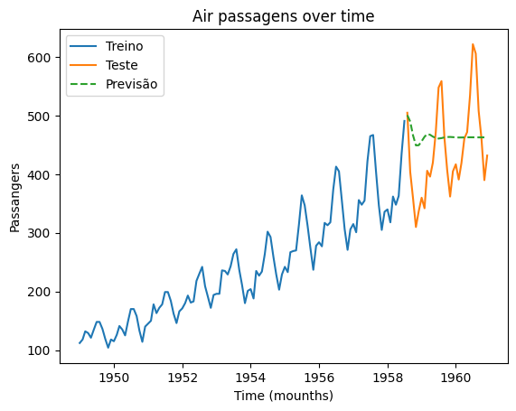
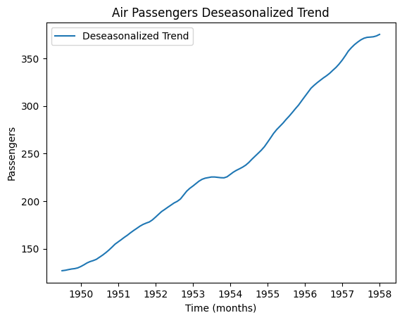
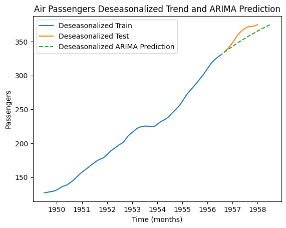

# Problem Context

I am currently taking a class on Time Series, which is an introductory course covering the basic concepts of machine learning. It's an elective course, so it's not part of the core curriculum. There are no exams, only assignments where we are tasked with researching, implementing, and presenting solutions.

For one of our assignments, the professor has asked us to select a dataset from Kaggle and implement prediction models using both ARIMA and MLP. Afterward, we are required to calculate the WMAPE (Weighted Mean Absolute Percentage Error) to evaluate which model performs better.

# Dataset Description

I chose this dataset, which contains monthly totals of international airline passengers from 1949 to 1960. The dataset includes two columns: the first represents the date, and the second represents the number of passengers. This dataset is often used for time series analysis and forecasting, making it an ideal choice for implementing models like ARIMA and MLP. The clear trend and seasonality patterns present in the data provide a great opportunity to evaluate the performance of these prediction models.

# 1. Implementing ARIMA

Eu comcei com o básico, adicionando o dataset e lendo ele com pandas. Posteriormente, plotei o gráfico para entender como ele estava se comportando

```
url = 'https://raw.githubusercontent.com/jbrownlee/Datasets/master/airline-passengers.csv'
data = pd.read_csv(url, index_col='Month', parse_dates=True)
plt.plot(data)
plt.title('Air passagens over time')
plt.xlabel('Time (mounths)')
plt.ylabel('Passangers')
plt.show()
```


Depois, fiz algumas pesquisas e análises para tentanr entender o que poderia ser extraído de informações desse gráfico, e cheguei nessa conclusão simples:

- Tendência: crescimento ao longo dos anos
- Sazionalidade: existe, aparentermente em períodos parecidos, o que pode indicar que existem épocas específicas de aumento (ferás, feriados, etc)
- Volatilidade Crescente: a variação entre os meses tamém está sendo maior

Então fui para separação dos dados, 80% para treino e 20% para testes

```python
train_size_sazionalido = int(len(data) * 0.8)
train_data_sazionalizado = data[:train_size_sazionalido]
test_data_sazionalizado = data[train_size_sazionalido:]

#Plotando codigo
plt.plot(train_data_sazionalizado, label='Treino')
plt.plot(test_data_sazionalizado, label='Teste')
plt.title('Air passagens over time')
plt.xlabel('Time (mounths)')
plt.ylabel('Passangers')
plt.legend()
```



Excelente, até aqui tudo ocorreu bem, então resolvi ajustar o modelo ARIMa, pelas configurações que encontrei, essa pareceu ser uma adequada:

```python
model = ARIMA(train_data_sazionalizado, order=(5,1,0))
model_fit = model.fit()
```

E então, hora de fazer a previsão e plotar o gráfico:

```python
arima_pred = model_fit.forecast(steps=len(test_data_sazionalizado))

plt.plot(train_data_sazionalizado, label='Treino')
plt.plot(test_data_sazionalizado, label='Teste')
plt.plot(arima_pred, label='Previsão', linestyle='--')
plt.title('Air passagens over time')
plt.xlabel('Time (mounths)')
plt.ylabel('Passangers')
plt.legend()
```


Batendo o olho no gráfico eu ja tinha entendi que ele não podia estar certo, então lembrei que a professora tinha falado sobre sazionalidade e que precisariamos remove-la, então refiz o gráfico a fim de torna-lo desasazional:

```python
result_sazional = seasonal_decompose(train_data_sazionalizado, model='additive', period=12)

plt.plot(result_sazional.trend, label='Deseasonalized Trend')
plt.title('Air Passengers Deseasonalized Trend')
plt.xlabel('Time (months)')
plt.ylabel('Passengers')
plt.legend()
plt.show()
```



Então refiz todo o processo e cheguei no grafico a seguir

```python
train_size = int(len(result_sazional.trend) * 0.8)
train_deseasonalized = result_sazional.trend[:train_size]
test_deseasonalized = result_sazional.trend[train_size:]
model_deseasonalized = ARIMA(train_deseasonalized, order=(5,1,0))
model_deseasonalized_fit = model_deseasonalized.fit()
arima_pred_deseasonalized = model_deseasonalized_fit.forecast(steps=len(test_deseasonalized))
plt.plot(train_deseasonalized, label='Deseasonalized Train')
plt.plot(test_deseasonalized, label='Deseasonalized Test')
plt.plot(arima_pred_deseasonalized, label='Deseasonalized ARIMA Prediction', linestyle='--')
plt.title('Air Passengers Deseasonalized Trend and ARIMA Prediction')
plt.xlabel('Time (months)')
plt.ylabel('Passengers')
plt.legend()
plt.show()
```


